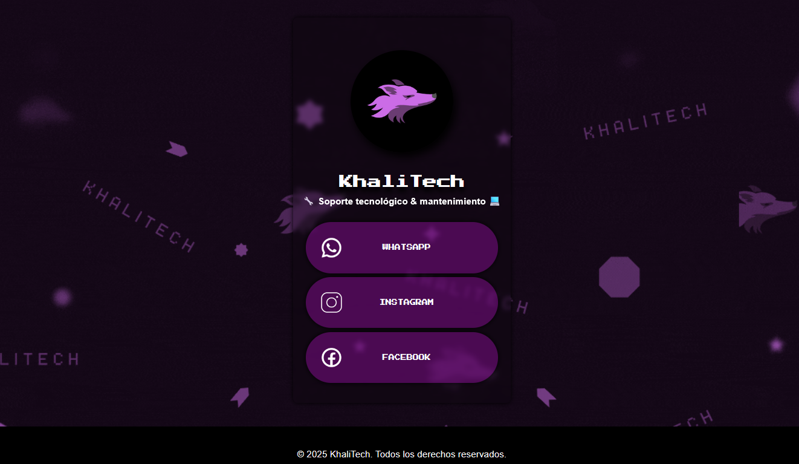

<h1 align="center"> 🟣 LinksKhalitech 🟣 </h1>
<h3 align="center">Página de enlaces centralizados para KhaliTech.</h3>

 
Este proyecto es una página estilo Linktree desarrollada para centralizar todos los enlaces de KhaliTech en un solo lugar.  
Incluye accesos rápidos a redes sociales y medios de contacto. 

  <a href="#-acerca-del-proyecto">Acerca del proyecto</a>&nbsp;&nbsp;&nbsp;|&nbsp;&nbsp;&nbsp;
  <a href="#-estado-del-proyecto">Estado del proyecto</a> &nbsp;&nbsp;&nbsp;

---
  

  

---

## 💡 Acerca del proyecto
Este proyecto fue desarrollado con el objetivo de centralizar todos los enlaces de **KhaliTech** en una sola página, al estilo Linktree.  
La idea principal es ofrecer a los clientes un acceso rápido a nuestras redes sociales, catálogo de productos y medios de contacto.  

Además de ser útil para el emprendimiento, este proyecto me permitió reforzar mis conocimientos en desarrollo web utilizando **HTML y CSS**, creando una solución práctica y adaptable a cualquier dispositivo.
- [Prueba](https://alexis4188.github.io/LinksKhalitech.github.io/)

---

## ✅ Estado del proyecto
Actualmente el proyecto se encuentra en su versión inicial y **funcional**.  
Aún se planean mejoras para optimizar la experiencia de usuario, entre ellas:  

- 🎨 Mejoras en el diseño visual.  
- 📱 Mayor compatibilidad con diferentes resoluciones y dispositivos móviles.  
- ⚡ Optimización del rendimiento y tiempos de carga.  
- 🔗 Posibilidad de añadir más enlaces dinámicos en el futuro.  

El proyecto se mantendrá en evolución, incorporando nuevas ideas y ajustes según las necesidades de **KhaliTech**.  

---

Saludos a todos! Que tengan un buen dia! <3
